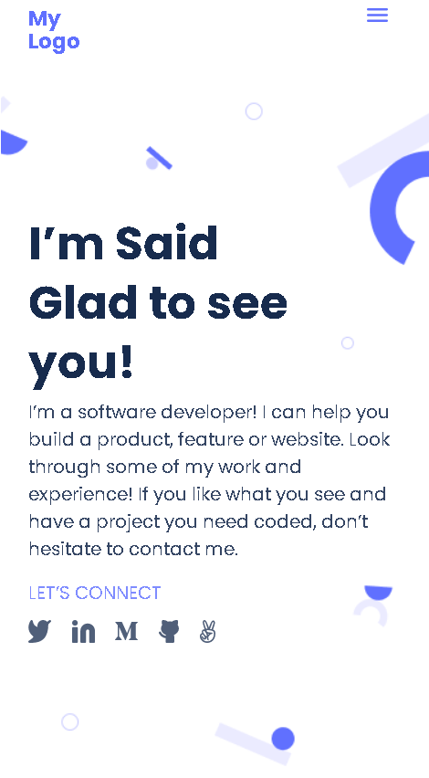

# "Microverse Portfolio" project

> This is my mobile version of "Portfolio" project based on the Microverse student's template.

Additional description about the project and its features.

## Built With

- HTML/CSS
- Linters
- GitHub/VSCode

## Live Demo

[Live Demo Link](https://raw.githack.com/SaidRasinlic/MicroversePortfolio/main/index.html)

## Getting Started

**This is an example of how you may give instructions on setting up your project locally.**
**Modify this file to match your project, remove sections that don't apply. For example: delete the testing section if the currect project doesn't require testing.**

To get a local copy up and running follow these simple example steps.

### Prerequisites

- GitHub/VSCode

### Setup

- gh repo clone SaidRasinlic/MicroversePortfolioRepetition

## Authors

👤 **Author1**

- GitHub: [@GitHub/SaidRasinlic](https://twitter.com/SaidRasinlic)
- Twitter: [@Twitter/SaidRasinlic](https://twitter.com/SaidRasinlic)
- LinkedIn: [LinkedIn/SaidRasinlic](https://www.linkedin.com/in/saidrasinlic)

## 🤝 Contributing

Contributions, issues, and feature requests are welcome!

Feel free to check the [issues page](../../issues/).

## Show your support

Give a ⭐️ if you like this project!

## Acknowledgments

- Hat tip to anyone whose code was used
- Inspiration
- etc

## 📝 License

This project is [MIT](LICENSE) licensed.
